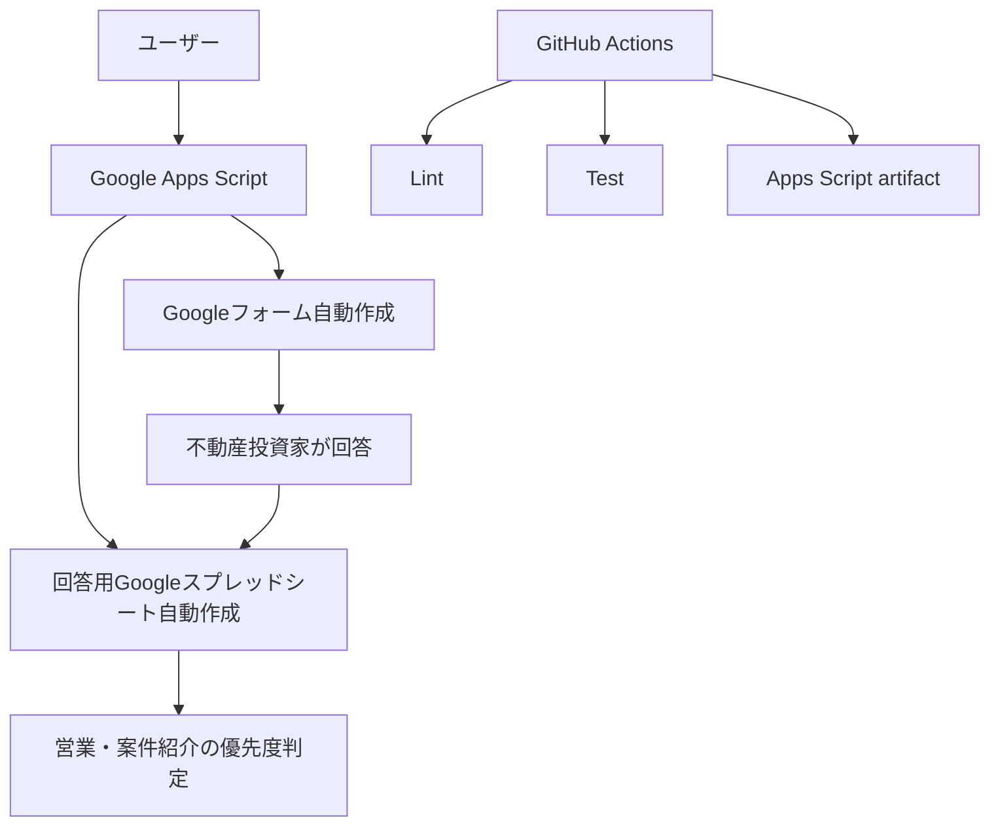

# アーキテクチャ

## 全体像

このプロジェクトは、Google Apps ScriptでGoogleフォームと回答用Googleスプレッドシートを自動作成する構成です。

## ユーザー入力

フォーム回答者は、以下のような買いニーズを入力します。

- 基本情報
- 購入経験
- 購入目的
- 希望物件種別
- 築年数
- エリア
- 価格帯
- 自己資金
- 融資状況
- 表面利回り
- 実質利回り
- 許容リスク
- NG条件
- 連絡方法

## フロントエンド

Googleフォーム自体がフロントエンドです。独自Webフロントエンドは持ちません。

## バックエンド

Google Apps Scriptがフォームとスプレッドシートを作成します。常時稼働するサーバーはありません。

## データベース

回答保存先はGoogleスプレッドシートです。別途DBは不要です。

## CI/CD

GitHub Actionsで以下を実行します。

- Node.jsセットアップ
- 仕様ファイルと必須ファイルのlint
- フォーム仕様テスト
- Apps Scriptファイルのartifact upload

## Secrets

このリポジトリの標準運用ではSecretsは不要です。

Google DriveやGoogleフォームへの作成は、Google Apps Scriptの実行時にGoogleアカウントの認可で行います。

## 今後の拡張案

- 回答内容からA/B/Cランクを自動計算するApps Scriptを追加
- 回答時にメール通知を送る
- LINE通知やSlack通知と連携
- 物件情報とのマッチングスコアを自動計算
- 回答スプレッドシートに営業ステータス列を追加
- Looker Studioで投資家属性ダッシュボードを作成
